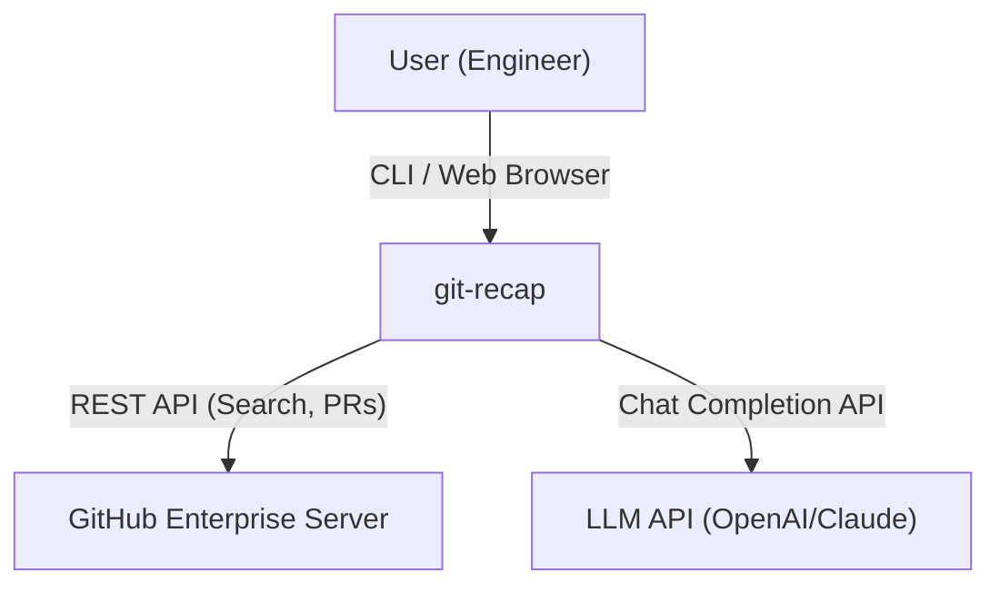
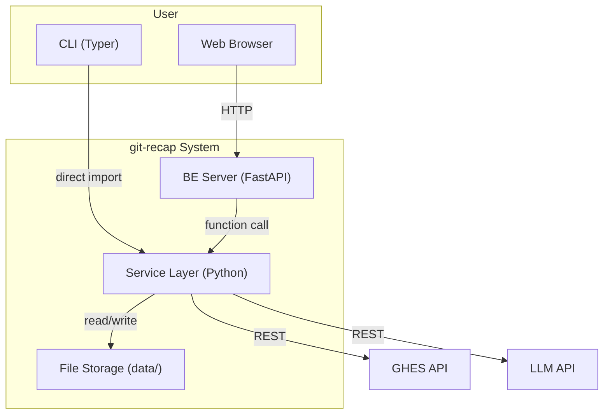
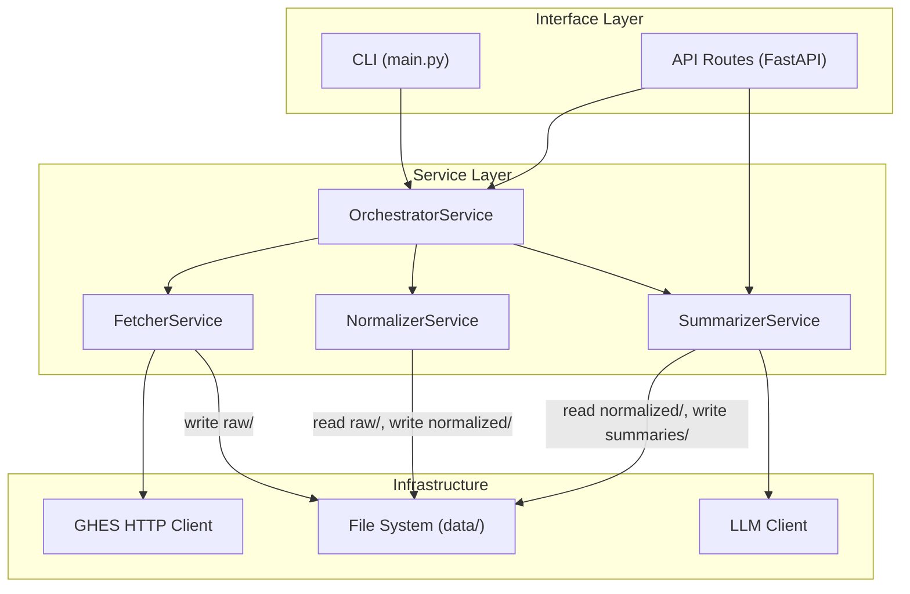

# git-recap: Technical Design Document

## 1. 프로젝트 개요

GitHub Enterprise Server(GHES)의 PR, commit, issue, review, comment 데이터를 수집하여
LLM 기반으로 일/주/월/년 단위 업무 요약을 자동 생성하는 개인 도구.

**핵심 원칙:**
- 모든 중간 산출물은 파일로 저장 (DB 미사용, idempotent)
- 수치(PR 수, line count 등)는 스크립트가 계산, LLM은 서술만 담당
- 상위 summary는 하위 summary를 input으로 사용 (hierarchical map-reduce)
- RAG/MCP 미사용. GitHub REST API 직접 호출

---

## 2. 요구사항

### 2.1 기능 요구사항

| ID | 요구사항 | 담당 모듈 |
|---|---|---|
| FR-1 | GHES Search API로 사용자의 PR authored/reviewed/commented, commit, issue 활동을 날짜 기준 수집 | Fetcher |
| FR-2 | Raw 데이터를 정규화된 Activity 포맷으로 변환 | Normalizer |
| FR-3 | Activity + 스크립트 수치 기반 daily/weekly/monthly/yearly summary 생성 | Summarizer |
| FR-4 | 상위 summary는 하위 summary를 input으로 사용 | Summarizer |
| FR-5 | CLI에서 fetch/normalize/summarize를 개별 또는 파이프라인으로 실행. fetch/normalize/summarize daily는 공통 날짜 범위 옵션(--since/--until, --weekly, --monthly, --yearly) 지원 | CLI |
| FR-6 | 웹 페이지에서 BE API를 통해 동일 기능 실행 | API + Frontend |
| FR-7 | 자유 질문 → 최근 summary 기반 LLM 응답 | Summarizer |

### 2.2 비기능 요구사항

| ID | 요구사항 | 구현 방식 |
|---|---|---|
| NFR-1 | DB 미사용 | 파일 시스템 저장 (data/) |
| NFR-2 | RAG 미사용 | 기간별 summary 계층으로 토큰 관리 |
| NFR-3 | MCP 미사용 | GitHub REST API 직접 호출 |
| NFR-4 | 각 단계 산출물이 파일로 남아 재실행/디버깅 가능 | idempotent 파이프라인 |
| NFR-5 | 수치는 스크립트가 계산, LLM은 서술만 | stats.json 분리 |
| NFR-6 | FE의 LLM 호출은 async job | BackgroundTasks + polling |
| NFR-7 | 노이즈 필터링 (bot, LGTM 등) | Fetcher 단계에서 제거 |

### 2.3 설계 제약

- GHES API v3 (REST) 사용. GraphQL은 GHE 버전 의존성이 있어 REST 우선
- Search API rate limit: 인증 요청 기준 30 req/min
- 토큰/credential은 환경변수로 관리 (.env), 파일에 직접 저장 금지

---

## 3. 아키텍처

### 3.1 System Context (C4 Level 1)



### 3.2 Container (C4 Level 2)



CLI는 ServiceLayer를 직접 import. FE(Browser)는 BE를 거쳐 동일한 ServiceLayer를 호출.
모든 중간 산출물은 FileStore에 저장.

### 3.3 Component (C4 Level 3)



---

## 4. 데이터 흐름

### 4.1 파이프라인

```
GHES API
   │
   ▼
┌──────────────┐    ┌────────────────┐    ┌─────────────────┐
│   Fetcher    │───▶│   Normalizer   │───▶│   Summarizer    │
│              │    │                │    │                 │
│ raw/         │    │ normalized/    │    │ summaries/      │
│  prs.json    │    │  activities.   │    │  daily/02-16.md │
│  commits.json│    │  jsonl         │    │  weekly/W07.md  │
│  issues.json │    │  stats.json    │    │  monthly/02.md  │
└──────────────┘    └────────────────┘    └─────────────────┘
```

- **Fetcher**: GHES API → `data/raw/{YYYY}/{MM}/{DD}/prs.json` + `commits.json` + `issues.json`
- **Normalizer**: prs.json → `data/normalized/{YYYY}/{MM}/{DD}/activities.jsonl` + `stats.json`
- **Summarizer**: activities + stats → `data/summaries/{YYYY}/daily/{MM}-{DD}.md`

### 4.2 Hierarchical Summary 전략

```
Daily:   normalized activities + stats  →  LLM  →  daily.md
Weekly:  7개 daily.md                   →  LLM  →  weekly.md
Monthly: 4~5개 weekly.md               →  LLM  →  monthly.md
Yearly:  12개 monthly.md               →  LLM  →  yearly.md
```

각 레벨은 하위 레벨의 산출물만 input으로 받아 토큰 사용량을 제어한다.

---

## 5. 프로젝트 구조

```
git-recap/
├── .env                           # GHES_URL, GHES_TOKEN, LLM_API_KEY
├── .env.example                   # 환경변수 템플릿
├── pyproject.toml
├── design.md                      # 전체 설계 문서 (이 파일)
├── designs/                       # 모듈별 상세 설계
│   ├── models.md
│   ├── fetcher.md
│   ├── normalizer.md
│   ├── summarizer.md
│   ├── orchestrator.md
│   ├── cli.md
│   ├── api.md
│   └── frontend.md
├── prompts/                       # LLM 프롬프트 템플릿
│   ├── daily.md
│   ├── weekly.md
│   ├── monthly.md
│   ├── yearly.md
│   └── query.md
├── data/                          # .gitignore (런타임 데이터)
│   ├── state/
│   │   ├── checkpoints.json       # Fetcher incremental sync
│   │   └── jobs/                  # async job status
│   │       └── {job_id}.json
│   ├── raw/                       # Fetcher output
│   │   └── {YYYY}/{MM}/{DD}/
│   │       ├── prs.json
│   │       ├── commits.json
│   │       └── issues.json
│   ├── normalized/                # Normalizer output
│   │   └── {YYYY}/{MM}/{DD}/
│   │       ├── activities.jsonl
│   │       └── stats.json
│   └── summaries/                 # Summarizer output
│       └── {YYYY}/
│           ├── daily/{MM}-{DD}.md
│           ├── weekly/W{NN}.md
│           ├── monthly/{MM}.md
│           └── yearly.md
├── src/git_recap/
│   ├── __init__.py
│   ├── config.py                  # pydantic-settings AppConfig
│   ├── exceptions.py              # GitRecapError 계층
│   ├── models.py                  # 서비스 간 데이터 계약
│   ├── services/
│   │   ├── __init__.py
│   │   ├── date_utils.py
│   │   ├── fetcher.py
│   │   ├── normalizer.py
│   │   ├── summarizer.py
│   │   └── orchestrator.py
│   ├── infra/
│   │   ├── __init__.py
│   │   ├── ghes_client.py         # GHES HTTP client (retry, rate limit)
│   │   └── llm_client.py          # LLM client (provider-agnostic)
│   ├── api/
│   │   ├── __init__.py
│   │   ├── app.py                 # FastAPI app + exception handler
│   │   └── routes/
│   │       ├── pipeline.py        # POST /run, GET /jobs/{id}
│   │       ├── summary.py         # GET /summary/daily/{date}
│   │       └── query.py           # POST /query
│   └── cli/
│       ├── __init__.py
│       └── main.py                # Typer CLI
├── tests/
│   ├── conftest.py                # 공통 fixture (tmp_data_dir, mock config)
│   ├── fixtures/                  # 테스트용 JSON fixture 파일
│   │   ├── raw_prs_sample.json
│   │   ├── activities_sample.jsonl
│   │   └── stats_sample.json
│   ├── unit/
│   │   ├── test_models.py
│   │   ├── test_config.py
│   │   ├── test_exceptions.py
│   │   ├── test_fetcher.py
│   │   ├── test_normalizer.py
│   │   ├── test_summarizer.py
│   │   ├── test_orchestrator.py
│   │   ├── test_cli.py
│   │   ├── test_api.py
│   │   ├── test_date_utils.py
│   │   ├── test_ghes_client.py
│   │   └── test_llm_client.py
│   └── integration/
│       └── test_pipeline.py       # fetch → normalize → summarize 통합
└── frontend/
    └── ...
```

---

## 6. 모듈 인터페이스 계약

### 6.1 데이터 모델 (models.py)

모든 서비스 간 데이터 교환은 이 모델을 통해 이루어진다.

```python
from dataclasses import dataclass, field
from enum import Enum


# ── Fetcher output ──

@dataclass
class FileChange:
    filename: str
    additions: int
    deletions: int
    status: str              # added | modified | removed | renamed

@dataclass
class Comment:
    author: str
    body: str
    created_at: str          # ISO 8601
    url: str

@dataclass
class Review:
    author: str
    state: str               # APPROVED | CHANGES_REQUESTED | COMMENTED
    body: str
    submitted_at: str        # ISO 8601
    url: str

@dataclass
class PRRaw:
    url: str                 # HTML URL
    api_url: str             # API URL
    number: int
    title: str
    body: str
    state: str               # open | closed
    is_merged: bool
    created_at: str          # ISO 8601
    updated_at: str          # ISO 8601
    merged_at: str | None    # ISO 8601 or None
    repo: str                # "org/repo-name"
    labels: list[str]
    author: str
    files: list[FileChange]
    comments: list[Comment]
    reviews: list[Review]

@dataclass
class CommitRaw:
    sha: str
    url: str                 # HTML URL
    api_url: str
    message: str             # full commit message
    author: str              # GitHub login
    repo: str                # "org/repo"
    committed_at: str        # ISO 8601
    files: list[FileChange]

@dataclass
class IssueRaw:
    url: str                 # HTML URL
    api_url: str
    number: int
    title: str
    body: str
    state: str               # open | closed
    created_at: str          # ISO 8601
    updated_at: str          # ISO 8601
    closed_at: str | None    # ISO 8601 or None
    repo: str                # "org/repo-name"
    labels: list[str]
    author: str
    comments: list[Comment]


# ── Normalizer output ──

class ActivityKind(str, Enum):
    PR_AUTHORED = "pr_authored"
    PR_REVIEWED = "pr_reviewed"
    PR_COMMENTED = "pr_commented"
    COMMIT = "commit"
    ISSUE_AUTHORED = "issue_authored"
    ISSUE_COMMENTED = "issue_commented"

@dataclass
class Activity:
    ts: str                  # ISO 8601, 활동 발생 시각
    kind: ActivityKind
    repo: str                # "org/repo-name"
    pr_number: int
    title: str
    url: str                 # PR HTML URL
    summary: str             # 스크립트가 생성하는 1줄 요약
    sha: str = ""            # commit SHA (COMMIT kind만 사용)
    files: list[str]         # 변경된 파일 경로 목록
    additions: int
    deletions: int
    labels: list[str]
    evidence_urls: list[str] # review/comment URL 목록

@dataclass
class DailyStats:
    date: str                # YYYY-MM-DD
    authored_count: int
    reviewed_count: int
    commented_count: int
    total_additions: int
    total_deletions: int
    repos_touched: list[str]
    authored_prs: list[dict]     # [{url, title, repo}]
    reviewed_prs: list[dict]     # [{url, title, repo}]
    commit_count: int
    issue_authored_count: int
    issue_commented_count: int
    commits: list[dict]          # [{url, title, repo, sha}]
    authored_issues: list[dict]  # [{url, title, repo}]


# ── Job status (async API) ──

class JobStatus(str, Enum):
    ACCEPTED = "accepted"
    RUNNING = "running"
    COMPLETED = "completed"
    FAILED = "failed"

@dataclass
class Job:
    job_id: str
    status: JobStatus
    created_at: str
    updated_at: str
    result: str | None = None     # 완료 시 결과 경로 또는 메시지
    error: str | None = None      # 실패 시 에러 메시지
```

### 6.2 FetcherService

```python
class FetcherService:
    def __init__(self, config: AppConfig, ghes_client: GHESClient) -> None: ...

    def fetch(self, target_date: str, *, types: set[str] | None = None) -> dict[str, Path]:
        """
        지정 날짜의 PR/Commit/Issue 활동을 GHES에서 수집하여 파일로 저장.

        Args:
            target_date: "YYYY-MM-DD" 형식
            types: 수집할 타입 ({"prs", "commits", "issues"}). None이면 전체.

        Returns:
            타입별 저장된 파일 경로 dict (e.g. {"prs": Path(...), "commits": Path(...), ...})

        Raises:
            FetchError: GHES API 호출 실패 시

        산출물: prs.json (list[PRRaw]), commits.json (list[CommitRaw]),
                issues.json (list[IssueRaw])
        멱등성: 동일 날짜 재실행 시 파일 덮어쓰기
        """

    def fetch_range(
        self, since: str, until: str,
        types: set[str] | None = None,
        force: bool = False,
    ) -> list[dict]:
        """
        월 단위 chunk 검색 → 날짜별 enrich/save. 실패 시 계속 진행.

        Args:
            since, until: "YYYY-MM-DD" 범위 (inclusive)
            types: 수집할 타입. None이면 전체.
            force: True이면 이미 fetch한 날짜도 재수집.

        Returns:
            [{"date": "...", "status": "success"|"skipped"|"failed", ...}]

        day-by-day fetch 대비 ~30배 빠름 (월 단위 Search API 호출로 최적화).
        이미 fetch한 날짜(3개 파일 모두 존재)는 skip (force=True 시 무시).
        """
```

**`fetch()` 내부 동작:**
1. **PR 파이프라인**: Search API 3축 쿼리 (`author`, `reviewed-by`, `commenter`) → dedup → enrich (files, comments, reviews) → 노이즈 필터링 → `prs.json`
2. **Commit 파이프라인**: Commit Search API (`author`, `committer-date`) → enrich (`get_commit`으로 files 포함) → `commits.json` (GHES 미지원 시 graceful skip)
3. **Issue 파이프라인**: Search API 2축 (`author`, `commenter`) → dedup → enrich (`get_issue` + `get_issue_comments`) → 노이즈 필터링 → `issues.json`
4. checkpoints.json 갱신 (마지막 성공 날짜 기록)

**`fetch_range()` 내부 동작:**
1. `monthly_chunks(since, until)` → 월 단위 (start, end) 쌍 목록
2. 각 chunk에 대해 `_search_prs_range()`, `_search_commits_range()`, `_search_issues_range()` 호출 (날짜 범위 검색, 6 API calls/chunk)
3. `_bucket_by_date()` → 검색 결과를 `updated_at`/`committer_date` 기준으로 날짜별 분류
4. 각 날짜에 대해: `_is_date_fetched()` → skip 판단 → enrich + save → checkpoint 갱신
5. 실패한 날짜는 기록하고 다음 날짜로 계속 진행 (resilience)
6. 검색 결과 >= 1000건 시 truncation warning 로깅

### 6.3 NormalizerService

```python
class NormalizerService:
    def __init__(self, config: AppConfig) -> None: ...

    def normalize(self, target_date: str) -> tuple[Path, Path]:
        """
        Raw PR 데이터를 Activity 목록과 통계로 변환.

        Args:
            target_date: "YYYY-MM-DD" 형식

        Input:
            data/raw/{Y}/{M}/{D}/prs.json (필수, list[PRRaw])
            data/raw/{Y}/{M}/{D}/commits.json (optional, list[CommitRaw])
            data/raw/{Y}/{M}/{D}/issues.json (optional, list[IssueRaw])

        Returns:
            (activities_path, stats_path) 튜플
            - data/normalized/{Y}/{M}/{D}/activities.jsonl
            - data/normalized/{Y}/{M}/{D}/stats.json

        Raises:
            NormalizeError: prs.json 없음 또는 파싱 실패 시

        멱등성: 동일 날짜 재실행 시 파일 덮어쓰기
        """
```

**내부 동작:**
1. prs.json 로드 → `list[PRRaw]` (필수), commits.json → `list[CommitRaw]`, issues.json → `list[IssueRaw]` (optional, 하위 호환)
2. PR 활동 분류: `PR_AUTHORED`, `PR_REVIEWED`, `PR_COMMENTED`
3. Commit → `COMMIT` Activity (title: message 첫 줄 120자 truncate)
4. Issue → `ISSUE_AUTHORED` (author+date 매치), `ISSUE_COMMENTED` (사용자 comment on date)
5. 전체 활동 시간순 정렬
6. DailyStats 계산: PR/commit/issue 카운터, additions/deletions (authored PR + commit 합산)
7. activities.jsonl + stats.json 저장

### 6.4 SummarizerService

```python
class SummarizerService:
    def __init__(self, config: AppConfig, llm_client: LLMClient) -> None: ...

    def daily(self, target_date: str) -> Path:
        """
        Daily summary 생성.

        Input:
            - data/normalized/{Y}/{M}/{D}/activities.jsonl
            - data/normalized/{Y}/{M}/{D}/stats.json
            - prompts/daily.md (템플릿)

        Returns:
            data/summaries/{Y}/daily/{MM}-{DD}.md

        Raises:
            SummarizeError: 입력 파일 없음 또는 LLM 호출 실패 시
        """

    def weekly(self, year: int, week: int) -> Path:
        """
        Weekly summary 생성.

        Input: 해당 주의 daily.md 파일들 (ISO week 기준)
        Returns: data/summaries/{Y}/weekly/W{NN}.md
        """

    def monthly(self, year: int, month: int) -> Path:
        """
        Monthly summary 생성.

        Input: 해당 월의 weekly.md 파일들
        Returns: data/summaries/{Y}/monthly/{MM}.md
        """

    def yearly(self, year: int) -> Path:
        """
        Yearly summary 생성.

        Input: 해당 연도의 monthly.md 파일들
        Returns: data/summaries/{Y}/yearly.md
        """

    def query(self, question: str, months_back: int = 3) -> str:
        """
        자유 질문 응답.

        Input: 최근 N개월 monthly.md를 context로 사용
        Returns: LLM 응답 문자열
        """
```

### 6.5 OrchestratorService

```python
class OrchestratorService:
    def __init__(
        self,
        fetcher: FetcherService,
        normalizer: NormalizerService,
        summarizer: SummarizerService,
    ) -> None: ...

    def run_daily(self, target_date: str) -> Path:
        """
        단일 날짜 전체 파이프라인: fetch → normalize → summarize(daily)

        Returns: daily summary 파일 경로
        Raises: StepFailedError (step 이름 + 원인 포함)

        실패 시 이전 단계 산출물은 보존됨.
        """

    def run_range(self, since: str, until: str) -> list[dict]:
        """
        기간 범위 backfill.

        Returns: [{date, status, error?}] 날짜별 결과
        실패한 날짜는 스킵하고 다음 날짜 계속 처리.
        """
```

### 6.6 Infrastructure — GHESClient

```python
class GHESClient:
    """GHES REST API HTTP client with retry and rate limit handling."""

    def __init__(self, base_url: str, token: str) -> None: ...

    def search_issues(self, query: str, page: int = 1) -> dict:
        """Search API 호출. 429 시 자동 retry with backoff."""

    def get_pr(self, owner: str, repo: str, number: int) -> dict: ...
    def get_pr_files(self, owner: str, repo: str, number: int) -> list[dict]: ...
    def get_pr_comments(self, owner: str, repo: str, number: int) -> list[dict]: ...
    def get_pr_reviews(self, owner: str, repo: str, number: int) -> list[dict]: ...

    def search_commits(self, query: str, page: int = 1) -> dict:
        """Commit Search API 호출. cloak-preview Accept 헤더 사용."""

    def get_commit(self, owner: str, repo: str, sha: str) -> dict: ...
    def get_issue(self, owner: str, repo: str, number: int) -> dict: ...
    def get_issue_comments(self, owner: str, repo: str, number: int) -> list[dict]: ...
```

- HTTP 라이브러리: `httpx`
- Retry: 429/5xx 시 exponential backoff (최대 3회)
- Rate limit: Search API 30 req/min 준수 (응답 헤더 X-RateLimit-Remaining 확인)

### 6.7 Infrastructure — LLMClient

```python
class LLMClient:
    """Provider-agnostic LLM client."""

    def __init__(self, provider: str, api_key: str, model: str) -> None: ...

    def chat(self, system_prompt: str, user_content: str) -> str:
        """
        LLM Chat Completion 호출.

        Args:
            system_prompt: 프롬프트 템플릿에서 로드한 시스템 프롬프트
            user_content: activities/stats/하위 summary 등 컨텐츠

        Returns:
            LLM 응답 텍스트

        Raises:
            SummarizeError: API 호출 실패 시
        """
```

- 지원 provider: `openai`, `anthropic`
- provider별 SDK 사용 (openai, anthropic 패키지)

### 6.8 Config

```python
class AppConfig(BaseSettings):
    ghes_url: str               # env: GHES_URL (e.g., "https://github.example.com")
    ghes_token: str             # env: GHES_TOKEN
    username: str               # env: GHES_USERNAME
    data_dir: Path = Path("data")
    prompts_dir: Path = Path("prompts")
    llm_provider: str = "openai"      # "openai" | "anthropic"
    llm_api_key: str            # env: LLM_API_KEY
    llm_model: str = "gpt-4o-mini"
    noise_patterns: list[str] = field(default_factory=lambda: [
        "^LGTM$", "^\\+1$", "^:shipit:$"
    ])
    model_config = {"env_file": ".env"}
```

### 6.9 Exceptions

```python
class GitRecapError(Exception):
    """Base exception for all git-recap errors."""

class FetchError(GitRecapError):
    """GHES API 호출 또는 raw 데이터 저장 실패."""
    step = "fetch"

class NormalizeError(GitRecapError):
    """Raw → Activity 변환 실패."""
    step = "normalize"

class SummarizeError(GitRecapError):
    """LLM 호출 또는 summary 생성 실패."""
    step = "summarize"

class StepFailedError(GitRecapError):
    """파이프라인 특정 단계 실패. Orchestrator가 발생시킴."""
    def __init__(self, step: str, cause: Exception):
        self.step = step
        self.cause = cause
        super().__init__(f"Pipeline failed at '{step}': {cause}")
```

**에러 매핑:**
- CLI: `GitRecapError` → stderr 출력 + exit code 1
- API: `FetchError` → HTTP 502, `SummarizeError` → HTTP 503, 나머지 → HTTP 500

---

## 7. 모듈 의존성 그래프

```
AppConfig ◄─────────────────────────────────────────┐
    │                                                │
    ├──► GHESClient ◄── FetcherService               │
    │                        │                       │
    ├──► LLMClient  ◄── SummarizerService            │
    │                        │                       │
    └──► NormalizerService   │                       │
              │              │                       │
              ▼              ▼                       │
         OrchestratorService ──────────────────────►─┘
              │
         ┌────┴────┐
         ▼         ▼
       CLI       API Routes
```

**의존성 방향 규칙:**
- Service Layer는 Infrastructure(client)에 의존
- Interface Layer(CLI, API)는 Service Layer에 의존
- Service 간에는 Orchestrator만 다른 Service를 의존
- 모든 Service는 AppConfig를 주입받음

---

## 8. 테스트 전략

### 8.1 원칙

- **TDD**: 각 ToDo는 먼저 테스트를 작성하고, 구현으로 통과시킴
- **외부 의존성 Mock**: GHES API, LLM API는 모두 mock/fixture 사용
- **파일 시스템**: `tmp_path` fixture로 격리된 data 디렉토리 사용

### 8.2 테스트 레벨

| 레벨 | 대상 | 도구 | 외부 의존성 |
|---|---|---|---|
| Unit | 개별 함수/메서드 | pytest | 모두 mock |
| Integration | Service 간 연결 | pytest | GHES/LLM mock, 실제 파일 시스템 |
| E2E | CLI 커맨드, API 엔드포인트 | pytest + typer.testing + httpx | 모두 mock |

### 8.3 모듈별 테스트 범위

**models.py:**
- 직렬화/역직렬화 round-trip (JSON ↔ dataclass)
- enum 값 검증

**FetcherService:**
- Search API 응답 파싱 (mock httpx)
- 3축 쿼리 결과 dedup 검증
- 노이즈 필터링 (bot, LGTM 등)
- 429 retry 동작 검증
- prs.json + commits.json + issues.json 파일 생성 검증
- Commit Search API 미지원 시 graceful skip
- Issue 2축 검색 + dedup

**NormalizerService:**
- PRRaw → Activity 변환 (kind 분류 정확성)
- CommitRaw → COMMIT Activity 변환 (title truncate)
- IssueRaw → ISSUE_AUTHORED / ISSUE_COMMENTED 변환
- 한 PR에 여러 역할 시 Activity 생성 규칙
- DailyStats 수치 정확성 (activities와 일치, commit/issue 카운터 포함)
- commits.json/issues.json optional 로딩 (하위 호환)
- 빈 입력 처리

**SummarizerService:**
- 프롬프트 템플릿 로딩 + 변수 치환
- LLM client 호출 검증 (mock)
- daily: activities + stats → markdown 생성
- weekly: daily.md 파일 수집 로직 (ISO week)
- 입력 파일 없을 때 에러 처리

**OrchestratorService:**
- run_daily: 3단계 순차 실행
- 중간 단계 실패 시 이전 산출물 보존
- run_range: 실패 날짜 스킵 후 계속 진행

### 8.4 Fixture 파일

`tests/fixtures/`에 실제 GHES API 응답 구조를 본뜬 샘플 JSON 저장:
- `ghes_search_response.json` — Search API 응답
- `ghes_pr_detail.json` — PR 상세
- `ghes_pr_files.json` — PR files
- `ghes_pr_comments.json` — PR comments
- `ghes_pr_reviews.json` — PR reviews
- `raw_prs_sample.json` — FetcherService 출력
- `activities_sample.jsonl` — NormalizerService 출력
- `stats_sample.json` — NormalizerService 출력

---

## 9. 설계 결정사항 (Blind Spots 해소)

### D-1: PR 활동 날짜 기준

**문제:** PR이 여러 날에 걸쳐 활동이 발생하면 어느 날짜에 포함시킬 것인가?

**결정:** **활동 발생 시각 기준**으로 해당 날짜에 포함.
- `pr_authored`: PR `created_at` 날짜
- `pr_reviewed`: Review `submitted_at` 날짜
- `pr_commented`: Comment `created_at` 날짜
- `commit`: Commit `committed_at` 날짜
- `issue_authored`: Issue `created_at` 날짜
- `issue_commented`: Issue comment `created_at` 날짜

동일 PR이 여러 날짜에 다른 kind로 등장할 수 있다. 이것은 의도된 동작이다 — 각 날짜의 활동 스냅샷을 보여주는 것이 목적.

### D-2: PR description이 없는 경우

**문제:** PR body가 비어있으면 summary 품질이 떨어진다.

**결정:** Normalizer의 auto_summary에서 body가 비면 변경된 파일 경로 기반으로 요약 생성.
예: `"pr_authored: [config, auth] 관련 파일 5개 변경 (+120/-30)"`

### D-3: GHES reviewed-by qualifier 미지원

**문제:** GHES 버전에 따라 `reviewed-by` qualifier가 미지원될 수 있다.

**결정:** Fetcher 초기화 시 `reviewed-by` 쿼리를 한 번 시도. 실패(422)하면 fallback으로
author/commenter 쿼리 결과의 PR에서 reviews를 enrich한 후 사용자 review 여부를 필터링.
이 fallback 모드는 config에 캐싱하여 매번 재시도하지 않음.

### D-4: Search API 날짜 필터링

**문제:** Search API의 `updated:YYYY-MM-DD` 쿼리는 해당 날짜에 업데이트된 PR을 반환하지만,
실제 활동(comment, review)이 해당 날짜에 발생했는지는 보장하지 않는다.

**결정:** Fetcher는 `updated:{date}` 쿼리로 후보 PR을 수집하고, Normalizer에서 각 activity의
실제 timestamp를 확인하여 target_date에 해당하지 않는 activity는 제거한다.

---

## 10. 구현 Phase & Task Breakdown

### Phase 0: 프로젝트 셋업

| Task | 설명 | 산출물 |
|---|---|---|
| T-0.1 | pyproject.toml, src layout, .env.example | 프로젝트 스켈레톤 |
| T-0.2 | config.py — AppConfig | .env 로딩 + validation |
| T-0.3 | exceptions.py — 에러 계층 | exception classes |
| T-0.4 | models.py — 데이터 모델 | dataclass + 직렬화 |

### Phase 1: Fetcher

| Task | 설명 | 검증 기준 |
|---|---|---|
| T-1.1 | GHESClient — HTTP client with retry | mock 서버 기반 retry 테스트 통과 |
| T-1.2 | Search API 3축 쿼리 + pagination + dedup | fixture 기반 dedup 테스트 통과 |
| T-1.3 | PR enrich + 노이즈 필터링 | PRRaw 생성, LGTM/bot 제거 검증 |
| T-1.4 | fetch() 통합 — JSON 저장 + checkpoint | prs.json 생성 + checkpoint 갱신 검증 |

### Phase 2: Normalizer

| Task | 설명 | 검증 기준 |
|---|---|---|
| T-2.1 | PRRaw → Activity 변환 (kind 분류) | kind 정확, 날짜 필터링 동작 |
| T-2.2 | DailyStats 계산 | 수치가 activities와 일치 |
| T-2.3 | normalize() 통합 | activities.jsonl + stats.json 생성 |

### Phase 3: Summarizer

| Task | 설명 | 검증 기준 |
|---|---|---|
| T-3.1 | 프롬프트 템플릿 작성 | placeholder 포함, 렌더링 테스트 |
| T-3.2 | LLMClient — provider-agnostic wrapper | mock 기반 호출 테스트 |
| T-3.3 | daily() — LLM 호출 → markdown 저장 | 파일 생성 + stats 수치 포함 검증 |
| T-3.4 | weekly/monthly/yearly() | hierarchical roll-up 검증 |
| T-3.5 | query() — 자유 질문 | context 로딩 + 응답 검증 |

### Phase 4: Orchestrator

| Task | 설명 | 검증 기준 |
|---|---|---|
| T-4.1 | run_daily() 파이프라인 | 3단계 순차 실행 검증 |
| T-4.2 | 에러 핸들링 — 이전 산출물 보존 | 실패 단계 이전 파일 존재 확인 |
| T-4.3 | run_range() backfill | 실패 날짜 스킵 검증 |

### Phase 5: CLI

| Task | 설명 | 검증 기준 |
|---|---|---|
| T-5.1 | Typer 기본 구조 + 헬퍼 (`_get_config`, `_handle_error`, `_resolve_dates`) | 각 서비스 독립 호출 |
| T-5.2 | fetch command (단일 날짜 + --type + 날짜 범위 + catch-up) | TestFetch, TypeFilter, DateRange, CatchUp |
| T-5.3 | normalize command + 날짜 범위 | TestNormalize, NormalizeDateRange |
| T-5.4 | summarize 서브커맨드 (daily + 날짜 범위, weekly, monthly, yearly) | TestSummarize, SummarizeDailyDateRange |
| T-5.5 | run command + --since/--until | TestRun |
| T-5.6 | ask command | TestAsk |
| T-5.7 | 에러 출력 + exit code | stderr + exit(1) |

### Phase 6: BE API

| Task | 설명 | 검증 기준 |
|---|---|---|
| T-6.1 | FastAPI app + exception handler + CORS | /docs 접근 가능 |
| T-6.2 | POST /api/pipeline/run/{date} async | job_id 반환 |
| T-6.3 | GET /api/pipeline/jobs/{id} polling | 상태 전이 검증 |
| T-6.4 | GET /api/summary/* 조회 | .md 파일 읽기 반환 |
| T-6.5 | POST /api/query async | 비동기 응답 |

### Phase 7: Frontend

| Task | 설명 | 검증 기준 |
|---|---|---|
| T-7.1 | 날짜 선택 + pipeline 실행 UI | POST → polling → 결과 |
| T-7.2 | Summary 뷰어 (markdown 렌더링) | 렌더링 정상 |
| T-7.3 | Query 인터페이스 | 질문 → 응답 표시 |

### 구현 순서

```
Phase 0 (셋업)
  → Phase 1 (Fetcher) — 외부 의존 가장 많으므로 먼저 안정화
  → Phase 2 (Normalizer) — Fetcher output으로 바로 검증
  → Phase 3 (Summarizer) — 프롬프트 튜닝에 시간 소요
  → Phase 4 (Orchestrator) — 1~3 통합
  → Phase 5 (CLI) — Orchestrator 감싸기
  → Phase 6 (BE API) — 동일
  → Phase 7 (Frontend) — API 완성 후
```

Phase 1~3은 각각 독립 테스트 가능. 각 Phase의 모듈별 상세 설계는
`designs/{module}.md`에 별도 작성.
